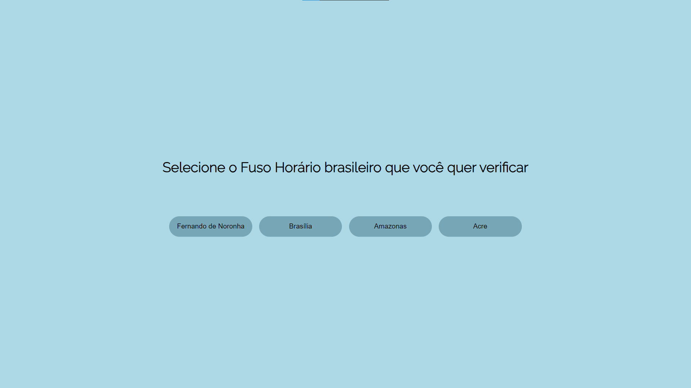

# Fuso Horário brasileiro

Projeto criado para conseguir acompanhar todos os fusos brasileiros no mesmo lugar.

[🔗 Clique aqui para acessar](https://hericlescosta.github.io/fusos-brasileiros/)

## 🛠 Tecnologias utilizadas

- React.js
- Moment.js
- Git e Github

## Contato

hericlesvitorio@gmail.com
